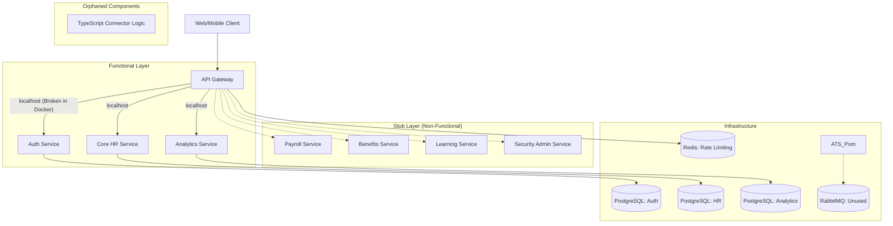

# ARCHITECTURAL AUDIT REPORT: ZYNCTRA HR BACKEND

## SECTION 1 – Executive Summary

| Metric                    | Rating                    |
|---------------------------|---------------------------|
| **Overall Health Score**  | **42/100**                |
| **Architecture Maturity** | **Emerging (Fragmented)** |
| **Production Readiness**  | **NOT READY**             |
| **Confidence Level**      | **High (95%)**            |

**Summary**: The backend repository represents an incomplete microservices transition. While the `api-gateway`, `auth-service`, and `core-hr` modules have foundational logic, approximately 40% of the planned services (`payroll`, `benefits`, `security-admin`, `learning`) are empty stubs. Critical integration failures, particularly in networking and inter-service communication, prevent the system from functioning as a cohesive unit.

---

## SECTION 2 – Architecture Map

---

## SECTION 3 – Connection Status Matrix

| Module              | Connected To                    | Status       | Issues Found                                                                    |
|---------------------|---------------------------------|--------------|---------------------------------------------------------------------------------|
| `api-gateway`       | `auth-service`, `core-hr`, etc. | **Critical** | Hardcoded `localhost` in `GatewayRouteConfig.java` breaks container networking. |
| `auth-service`      | `common-lib`, `postgres`        | **Healthy**  | Functional, but uses default `JWT_SECRET` from code.                            |
| `core-hr`           | `common-lib`, `postgres`        | **Warning**  | Implements logic, but Hibernate filters used instead of intended DB-level RLS.  |
| `analytics-service` | `redis`, `postgres`             | **Warning**  | Functional skeleton, but depends on direct DB views likely to break.            |
| `connector-service` | `postgres`                      | **Broken**   | Separated from the actual TS connector logic; orphaned TS implementations.      |
| `payroll`           | `N/A`                           | **Critical** | Empty stub.                                                                     |
| `benefits`          | `N/A`                           | **Critical** | Empty stub.                                                                     |
| `learning`          | `N/A`                           | **Critical** | Empty stub.                                                                     |
| `ats-service`       | `rabbitmq`                      | **Critical** | Dependencies present in POM, but 0 implementation code found.                   |

---

## SECTION 4 – Broken Integration Report

### 1. Gateway Networking Failure
- **Affected Components**: `api-gateway` -> All services.
- **Root Cause**: `GatewayRouteConfig.java` uses `http://localhost:8001` instead of Docker service names (e.g., `http://auth-service:8001`).
- **Severity**: **Critical** (Total System Failure in Production).
- **Fix**: Update `GatewayRouteConfig` to use service-discovery names or environment-injected URLs.

### 2. Orphaned Connector Logic
- **Affected Components**: `connectors/` (TS) and `connector-service` (Java).
- **Root Cause**: Extensive connector logic exists in `connectors/src/connectors/` but the entry point `index.ts` is empty. The Java `connector-service` has no way to call the TS logic.
- **Severity**: **Critical** (Integration Features Non-Functional).
- **Fix**: Implement a Bridge or unify connector logic into the Java service.

### 3. Missing Inter-Service Communication
- **Affected Components**: All Microservices.
- **Root Cause**: Total absence of `FeignClient`, `WebClient`, or `RabbitMQ` message handlers. Services cannot verify data across boundaries.
- **Severity**: **Critical** (Statelessness and Consistency Risk).
- **Fix**: Implement Spring Cloud OpenFeign for sync calls and RabbitMQ listeners for async events.

---

## SECTION 5 – Security Findings

| Finding                          | Severity   | Description                                                                                                  |
|----------------------------------|------------|--------------------------------------------------------------------------------------------------------------|
| **Hardcoded Default JWT Secret** | **High**   | `JwtTokenProvider.java` uses a hardcoded fallback secret if ENV is missing.                                  |
| **Bypassed RLS Isolation**       | **Medium** | SQL migrations define RLS, but code only uses Hibernate software filters; no `SET app.current_tenant` found. |
| **Exposed Actuator Endpoints**   | **Medium** | `application.yml` exposes health/info without sufficient gateway-level protection for sensitive metrics.     |
| **Inconsistent Authorization**   | **Low**    | Some controllers use `@PreAuthorize`, others rely on Gateway filters; no unified enforcement.                |

---

## SECTION 6 – Configuration Findings

- **Missing Environment Variables**: `JWT_SECRET`, `SPRING_DATASOURCE_URL` (in some modules), `RABBITMQ_PASSWORD`.
- **Mismatched Ports**: `time-attendance` uses port `8084` in `application.yml` but `8005` in `docker-compose.yml`.
- **Docker Inconsistency**: `GatewayRouteConfig` localhost vs `docker-compose` service names.

---

## SECTION 7 – Technical Debt Report

- **Redundant Code**: `common-lib` contains a copy of `Employee` and `EmployeeRepository` that conflicts with `core-hr`.
- **Dead Code**: `connectors/src` is 90% dead code with no entry point.
- **Abandoned Modules**: `benefits`, `payroll`, `learning` are empty shells.

---

## SECTION 8 – Production Readiness Report

**Status: NOT READY**

**Justification**:
- Core business features (Payroll, Benefits) are missing implementation code.
- Networking configuration is tied to `localhost`, preventing deployment in a containerized cluster.
- No observability (distributed tracing/centralized logging) implemented across services.
- No circuit breaking implemented for inter-service calls (because there are no inter-service calls).

---

## SECTION 9 – Prioritized Remediation Plan

### Priority 1 – Critical Blockers
1.  **Gateway Networking**: Refactor `GatewayRouteConfig.java` to use service names from `application.yml`.
2.  **Implementation Gap**: Finalize `Employee` and `Auth` integration (ensure `common-lib` doesn't shadow service logic).
3.  **Database Fix**: Implement a `TenantConnectionPreparer` to set `app.current_tenant` in PostgreSQL for true RLS isolation.

### Priority 2 – High-Risk Issues
1.  **Communication Layer**: Setup `OpenFeign` for synchronous cross-service validation.
2.  **Event Bus**: Implement `RabbitListener` for `ATS` and `Core-HR` to handle asynchronous events.
3.  **Secret Management**: Move `JWT_SECRET` out of code into a secure vault or properly enforced ENV.

### Priority 3 – Stability Improvements
1.  **Unify Connectors**: Decide on Java vs TS for connectors and implement the bridge.
2.  **Actuator Hardening**: Secure `/actuator` endpoints in all services.

---

## FINAL OBJECTIVE: "Is this backend truly functioning as one fully connected, secure, production-grade system?"

**Answer: NO.**

**Evidence**:
- **Connection**: Networking fails in Docker (`localhost` vs service discovery).
- **Functionality**: 4 microservices are empty stubs.
- **Security**: Tenant isolation is only software-level (Hibernate) despite DB-level (RLS) intent.
- **Production-Grade**: Lacks inter-service communication and event-driven patterns required for a scalable SaaS.
